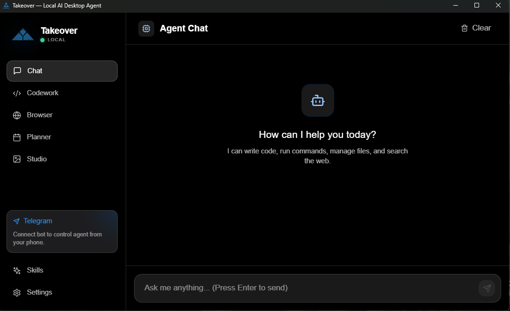
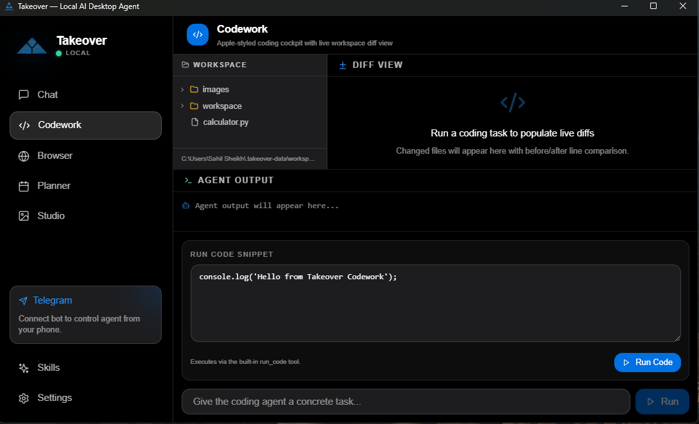
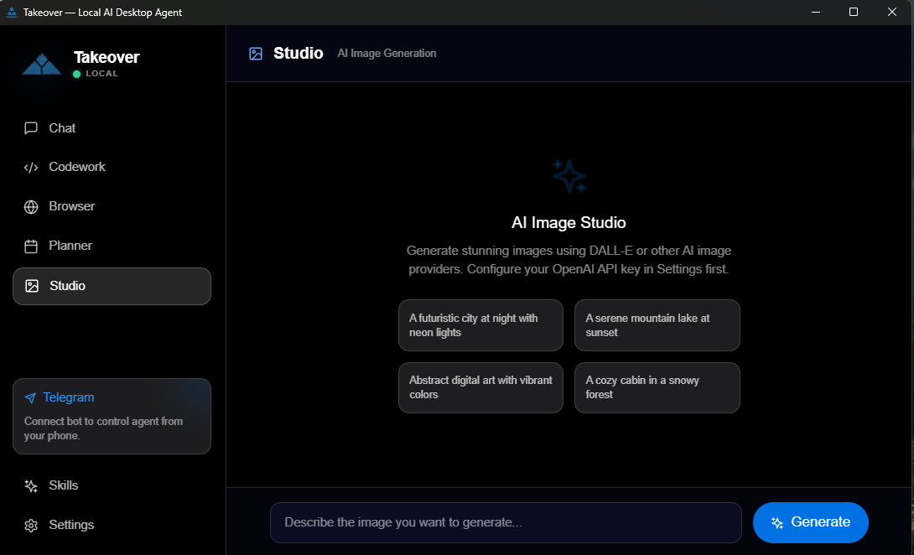

# Takeover

Takeover is a local-first AI desktop workspace for people who want one place to chat, plan, run tools, and automate work.

It runs on your machine through Electron, stores data locally by default, and supports bring-your-own-model providers.

## Why people use Takeover

- Keep control of your data with local storage.
- Work from a single dashboard instead of juggling multiple AI tools.
- Connect Telegram for quick approvals and remote interaction.
- Use built-in tools for files, commands, browser tasks, and automations.
- Switch between providers based on speed, quality, or cost.

## Preview

<p>
	
	
	
</p>


## Main Features

- Multi-provider AI chat with streaming responses
- Dashboard modules: Chat, Planner, Codework, Browser, Skills, Studio, Settings
- Runtime services for tasks, teams, cron jobs, and approvals
- Telegram integration with user ID authentication, inline approvals, and message/file handling
- MCP server setup with presets and startup tests
- Tooling actions for filesystem operations, command execution, code execution, web search, browser extraction, and image generation
- Session persistence so your work context is not lost between runs

## Quick Start

### 1. Install prerequisites

- Node.js 18+ (latest LTS recommended)
- npm
- Optional for local inference: Ollama

### 2. Install dependencies

```bash
npm install
cd apps/web
npm install
cd ../..
```

### 3. Start the desktop app

```bash
npm run dev
```

Takeover automatically picks an available local port in the `3000-3005` range.

## First-Time Setup (Recommended)

### Step 1: Connect a model provider

1. Open Settings inside the app.
2. Add a provider and credentials.
3. Select model defaults.
4. Save and run a quick chat test.

### Step 2: Configure Telegram (optional)

1. Create a bot through `@BotFather` and copy the token.
2. Open `Settings -> Telegram`.
3. Enable Telegram and paste the token.
4. Set your numeric Telegram user ID in `Allowed User ID`.
5. Restart the app.
6. Send `/start` to your bot.
7. Use `/whoami` if you need to confirm your numeric ID.

### Step 3: Configure MCP servers (optional)

1. Open `Settings -> MCP Servers`.
2. Click `Add Presets`.
3. Set command, args, and cwd for each server you want.
4. Click `Test` for each enabled server.
5. Save and restart.

## Supported Providers

Takeover currently supports these provider IDs:

- `ollama`
- `openai`
- `anthropic`
- `google`
- `groq`
- `openrouter`
- `mistral`
- `deepseek`
- `xai`
- `fireworks`
- `together`
- `cohere`
- `perplexity`
- `lmstudio`
- `custom`

Example local Ollama defaults:

```env
OLLAMA_BASE_URL=http://localhost:11434
OLLAMA_MODEL=qwen2.5:3b-instruct
```

## Local Data and Privacy

Default app data location:

- `~/.takeover-data`

Common files and folders:

- `settings.json` for app and provider settings
- `sessions/` for chat history
- `workspace/` for generated outputs
- `workspace/images/` for image artifacts
- `integrations/telegram.json` for Telegram configuration
- `cron/` for scheduled job metadata
- `memory/` for memory artifacts

To override the location:

- `TAKEOVER_DATA_DIR=/custom/path`

## Common Commands

Root:

- `npm run dev` start Electron in development
- `npm run dev:web` run only the Next.js web app
- `npm run dev:electron` run only Electron
- `npm run build:web` build the Next.js app
- `npm run build:win` build and package for Windows
- `npm run build:mac` build and package for macOS
- `npm run build:linux` build and package for Linux
- `npm run start` launch Electron

Inside `apps/web`:

- `npm run dev`
- `npm run build`
- `npm run start`
- `npm run lint`

## Build and Packaging

Packaging is configured in `electron-builder.yml`.

```bash
npm run build:win
npm run build:mac
npm run build:linux
```

Build output is written to `dist/`.

## Troubleshooting

1. App does not open: make sure another instance is not running and one of ports `3000-3005` is free.
2. Provider issues: re-check API key, model, and provider selection in Settings.
3. Telegram not responding: verify token, ensure `Allowed User ID` is correct, and restart after Telegram setting changes.
4. MCP tests fail: validate command and args in a terminal, then set `cwd` explicitly.

## More Documentation

- Product manual: [MANUAL.md](MANUAL.md)

## License

Takeover is open-source under the MIT License. Feel free to fork, contribute, or open issues.
